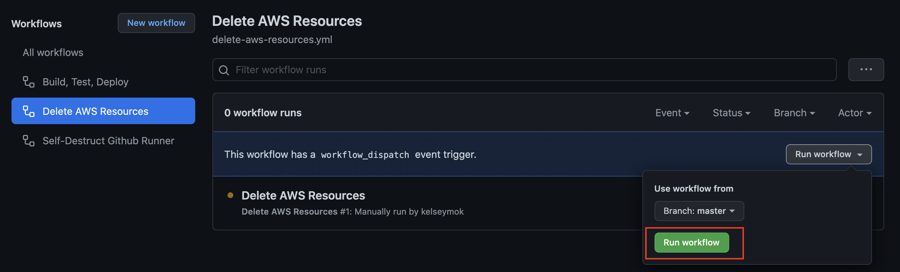

# CO2 vs. Temperature Exercise (Production Code)
This repository contains the production code contained in the associated [Databricks exercise](https://github.com/data-derp/exercise-co2-vs-temperature-databricks). The goal is to demonstrate what that logic would look like in production code, with tests, along with a pipeline to deploy it to a target.

To recall, the relevant questions that this code aims to answer are the following:
* Which countries are worse-hit (higher temperature anomalies)?
* Which countries are the biggest emitters?
* What are some attempts of ranking “biggest polluters” in a sensible way?

For more information on the data sources, please visit the [associated Databricks exercise](https://github.com/data-derp/exercise-co2-vs-temperature-databricks).

This code is designed to be deployed as an AWS Glue Job.

## Prerequisites
* Basic knowledge of Python, Spark, Docker, Terraform
* Access to an AWS account (Optional)

## Quickstart
1. [Mirror this repo](#mirror-the-repository) in your account as a **PRIVATE** repo (since you're running your own self-hosted Github Runners, you'll want to ensure your project is Private)
2. Set up your [Development Environment](./development-environment.md)
3. Fetch input data: `./go fetch-data`
4. **Optionally** set up a [CI/CD pipeline](#set-up-a-cicd-pipeline-optional)
5. **Optional, but required if step (4) was completed.** If you set up the pipeline in (4), you'll need to set up an AWS bucket to interact with
   * Simply run: `git submodule add git@github.com:data-derp/s3-bucket-aws-cloudformation.git` and the pipeline will take care of [setting up the bucket](https://github.com/data-derp/s3-bucket-aws-cloudformation#setup) for you
6. Fix the tests in `data-ingestion/` and `data-transformation/` (in that order). See [Development Environment](./development-environment.md) for tips and tricks on running python/tests in the dev-container.
7. [Delete your AWS Resources](#delete-your-aws-resources) when you're done if you ran (4) and (5) (or risk AWS charges)

## Delete your AWS Resources
**NOTE:** 10.05.2022: The Github Runner API Changed. This doesn't work anymore. Please manually delete your Cloudformation stacks from AWS (you'll need Admin Access and to empty your S3 bucket first). Workflows referenced below are now not copied.

### Github Runner
The Github Runner is the most expensive piece of infrastructure and can easily rack up charges. It's your responsibility to bring them down again. There is a "Self-Destruct" workflow that we provide which triggers the deletion, but doesn't check the final status (because once the Github Runner has been deleted, we don't have the AWS connection to check it from the pipeline.) 

Manually trigger the workflow:


Once this pipeline is successful, please visit AWS Cloudformation to ensure that the stack has been successfully deleted.

**NOTE:** at the moment, the Stack fails to delete completely (role/policy detatchments) because of a failsafe. The Github Runner role is designed to not be able to change its own policies. Until a change considered, this requires manual intervention by a user with higher permissions to fully delete the stack. However, the most important aspect is that it should successfully delete the compute machines that would impact your billing.

### AWS S3 Bucket
We provide a "Delete AWS Resources" pipeline which deletes the S3 bucket created in the Quickstart. 

Manually trigger the workflow:


## Mirror the Repository
1. Start importing a repository in your Github account:  
   

2. Import the `https://github.com/data-derp/exercise-co2-vs-temperature-production-code` as a **PRIVATE** repo called `exercise-co2-vs-temperature-production-code`:
   

3. Clone the new repo locally and add the original repository as a source:
```bash
git clone git@github.com:<your-username>/exercise-co2-vs-temperature-production-code.git
cd ./exercise-co2-vs-temperature-production-code
git remote add source git@github.com:data-derp/exercise-co2-vs-temperature-production-code.git 
```

4. To pull in new changes:
```bash
git fetch source
git rebase source/master
```
## Set up a CI/CD Pipeline (optional)
In this step, we will bootstrap a Self-Hosted Github Runner. [What is a Github Self-hosted Runner?](https://docs.github.com/en/actions/hosting-your-own-runners/about-self-hosted-runners)

1. Set up a [Github Runner](https://github.com/data-derp/github-runner-aws-cloudformation#setup)
2. Set up workflows:
```bash
./setup-workflows -p <your-project-name> -m <your-module-name> -r <aws-region>
```
3. Commit the new workflow template and push to see your changes.
4. Fix the tests in `data-ingestion/` and `data-transformation/` (in that order) and push to see your changes run in the pipeline. See [Development Environment](./development-environment.md) for tips and tricks on running python/tests in the dev-container.

## Future Development
- [x] Script to pull in data
- [x] Manual workflow to delete S3 Bucket and contents
- [x] Manual workflow to delete Github Runner Cloudformation Stack (and Github Runner Reg Token)
