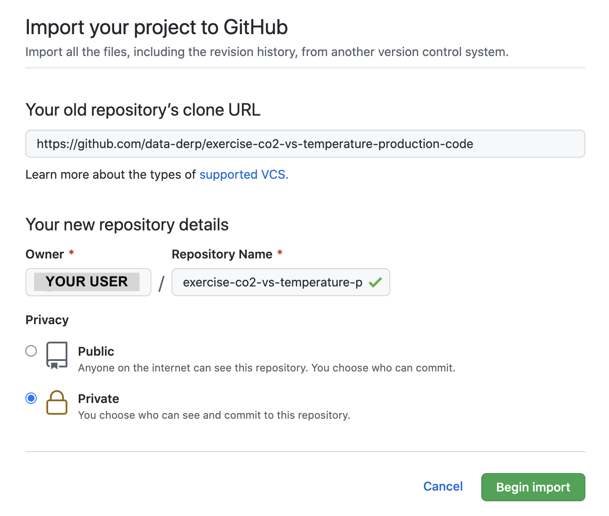

# CO2 vs. Temperature Exercise (Production Code)
This repository contains the production code contained in the associated [Databricks exercise](https://github.com/data-derp/exercise-co2-vs-temperature-databricks). The goal is to demonstrate what that logic would look like in production code, with tests, along with a pipeline to deploy it to a target.

To recall, the relevant questions that this code aims to answer are the following:
* Which countries are worse-hit (higher temperature anomalies)?
* Which countries are the biggest emitters?
* What are some attempts of ranking “biggest polluters” in a sensible way?

For more information on the data sources, please visit the [associated Databricks exercise](https://github.com/data-derp/exercise-co2-vs-temperature-databricks).

This code is designed to be deployed as an AWS Glue Job.

## Prerequisites
* Basic knowledge of Python, Spark, Docker, Terraform
* Access to an AWS account (Optional)

## Quickstart
1. [Mirror this repo](#mirror-the-repository) in your account as a **PRIVATE** repo (since you're running your own self-hosted Github Runners, you'll want to ensure your project is Private)
2. Set up your [Development Environment](./development-environment.md)
3. **Optionally** set up the [pipeline](#pipeline-optional)
4. Fix the tests in `data-ingestion/` and `data-transformation/` (in that order). See [Development Environment](./development-environment.md) for tips and tricks on running python/tests in the dev-container.

## Mirror the Repository
1. Start importing a repository in your Github account:  
   

2. Import the `https://github.com/data-derp/exercise-co2-vs-temperature-production-code` as a **PRIVATE** repo called `exercise-co2-vs-temperature-production-code`:
   

3. Clone the new repo locally and add the original repository as a source:
```bash
git clone git@github.com:<your-username>/exercise-co2-vs-temperature-production-code.git
cd ./exercise-co2-vs-temperature-production-code
git remote add source git@github.com:data-derp/exercise-co2-vs-temperature-production-code.git 
```

4. To pull in new changes:
```bash
git fetch source
git rebase source/master
```
## Pipeline (optional)
1. Bootstrap a Self-Hosted Github Runner
   * Hint: [What is a Github Self-hosted Runner?](https://docs.github.com/en/actions/hosting-your-own-runners/about-self-hosted-runners)
   * `git submodule add git@github.com:data-derp/bootstrap-github-runner-cloudformation.git`
   * Ensure your AWS Credentials are still valid and stored in an AWS Profile called `data-derp`
   * `./bootstrap-github-runner-cloudformation/github-runner/aws-deps -p <project-name> -m <module-name> -u <your-github-username>`
2. Create a Github workflow: `./go setup-workflow -p <project-name> -m <module-name>`
  * The `project-name` and `module-name` must be the same as step (3)
3. Fix the tests in `data-ingestion/` and `data-transformation/` (in that order). See [Development Environment](./development-environment.md) for tips and tricks on running python/tests in the dev-container.

## Future Development
- [ ] Dockerise `./setup-workflow`
- [ ] Option for running Github Runner locally in a Docker container